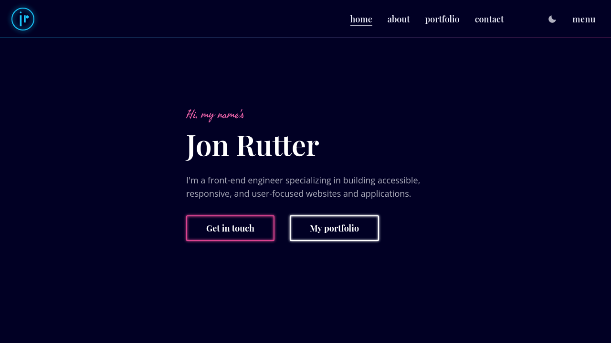

  
  <h1 align="center">jonrutter.io</h1>

The current iteration of my personal portfolio website.

  
Table of Contents

  <ol>
    <li><a href="#built-with">Built With</a></li>
    <li><a href="#license">License</a></li>
    <li><a href="#author">Author</a></li>
  </ol>

 

## Built with

- [TypeScript](https://www.typescriptlang.org/)
- [React](https://reactjs.org/)
- [Next.js](https://nextjs.org/)
- [Tailwind CSS](https://tailwindcss.com/)

## License

Copyright (c) 2023, Jon Rutter.

Site content (the textual content of the website and all material in ./content) is licensed under the [Creative Commons BY 4.0 license](https://creativecommons.org/licenses/by/4.0/) ([license text](https://creativecommons.org/licenses/by/4.0/legalcode)).

All other code is licensed under the MIT license. See LICENSE file for more information.

## Author

**Jon Rutter**

- [GitHub Profile](https://www.github.com/jonrutter)
- [Email](mailto:contact@jonrutter.io)
- [Website](https://www.jonrutter.io)
